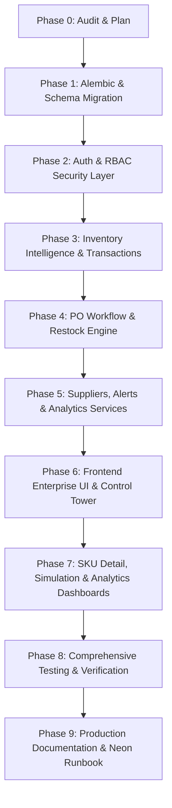

# Comprehensive Implementation Plan
**Project:** Automated Supply Chain Restock & Stockout Prevention Engine  
**Architecture:** FastAPI + Neon PostgreSQL + LightGBM + React 19 / Vite  
**Priority Hierarchy:** P0 (Core Foundation & Production Readiness) ➔ P1 (Advanced Operations & Intelligence) ➔ P2 (Ecosystem & High-Level Innovations)

---

## 1. Architectural Strategy & Design Principles

1. **Preserve Core IP**: Retain the LightGBM ML model (`model_v1.pkl`), feature engineering pipeline (`feature_engineering.py`), and statistical safety stock logic without breaking existing interfaces.
2. **Neon PostgreSQL Cloud Native**: Zero local PostgreSQL container dependency. Use connection pooling, SSL/TLS, Alembic versioned migrations, and persistent cloud storage.
3. **Enterprise Defense-in-Depth**: JWT authentication, Role-Based Access Control (RBAC with 5 roles: `ADMIN`, `MANAGER`, `INVENTORY_MANAGER`, `ANALYST`, `VIEWER`), bcrypt password hashing, and immutable audit logging.
4. **Data Integrity & Ledger**: Every stock change creates an `inventory_transactions` row (`RECEIPT`, `SALE`, `ADJUSTMENT`, `RETURN`, `DAMAGE`). No silent overwrites.
5. **Explainable AI (XAI)**: Provide deterministic, mathematically sound explanations for every SKU recommendation, stockout risk, and generated purchase order based directly on model outputs and live DB records.

---

## 2. Priority Phase Breakdown

### 🎯 P0: Absolutely Required (Core Foundation)

* **Phase 1: Neon Cloud Migration & Alembic System**
  - Finalize Neon PostgreSQL connection handling with retry logic and SSL.
  - Setup Alembic migration environment (`alembic init`, `env.py` linked to SQLAlchemy `Base.metadata`).
  - Generate initial baseline migration and future migration scripts.
  - Create documentation [`docs/NEON_MIGRATION.md`](file:///c:/Stock/docs/NEON_MIGRATION.md).
  - Update [`.env.example`](file:///c:/Stock/.env.example) and [`docker-compose.yml`](file:///c:/Stock/docker-compose.yml).

* **Phase 2: Database Schema Expansion & Normalization**
  - Add tables: `users`, `roles`, `suppliers`, `supplier_products`, `inventory_transactions`, `stock_alerts`, `audit_logs`, `forecast_runs`.
  - Add composite indexes for optimal lookup performance:
    - `(store_id, product_id, date)`
    - `(store_id, status)`
    - `(supplier_id, is_active)`
    - `(created_at, severity)`
  - Add `created_at` and `updated_at` audit timestamps across all tables.

* **Phase 3: Authentication & Role-Based Access Control (RBAC)**
  - JWT generation and token verification middleware (`python-jose` / `pyjwt`, `passlib[bcrypt]`).
  - User model with hashed passwords and defined roles (`ADMIN`, `MANAGER`, `INVENTORY_MANAGER`, `ANALYST`, `VIEWER`).
  - Auth endpoints: `POST /auth/login`, `POST /auth/register`, `GET /auth/me`, `POST /auth/refresh`.
  - Route guards enforcing fine-grained permissions across all mutating API routes.

* **Phase 4: Inventory Intelligence & Transaction Ledger**
  - Enhanced inventory schema tracking: `current_stock`, `reserved_stock`, `incoming_stock`, `reorder_point`, `safety_buffer`, `lead_time_days`.
  - Health state classifier: `HEALTHY`, `LOW_STOCK`, `CRITICAL`, `STOCKOUT`, `OVERSTOCK`, `DEAD_STOCK`.
  - Transaction engine: `POST /inventory/adjust`, `POST /inventory/receive`, `GET /inventory/transactions`.

* **Phase 5: Restock Decision & PO Lifecycle Workflow**
  - Decoupled restock evaluation:
    - `POST /restock/evaluate` (explicit execution with audit logging)
    - `GET /restock/preview` (pure read-only idempotent preview)
  - Full PO state machine: `DRAFT` ➔ `PENDING_APPROVAL` ➔ `APPROVED` ➔ `SENT` ➔ `PARTIALLY_RECEIVED` ➔ `RECEIVED` ➔ `CANCELLED`.
  - Automated inventory receipt on PO fulfillment with transaction logging.

* **Phase 6: Frontend Core Overhaul & Enterprise Dashboard**
  - Auth context and login screen with JWT storage and session restoration.
  - Multi-view navigation: Executive Control Tower, Inventory Matrix, PO Workflow, SKU Explorer.
  - Dynamic store/product lists loaded via API (removing hardcoded mocks).
  - Robust error handling: Loading skeletons, Empty states, Error boundaries, Toast notifications.

* **Phase 7: Test Suite & Security Hardening**
  - Expand pytest coverage across all new routes, auth guards, restock edge cases, and transaction ledgers.
  - Strict CORS configuration, sanitized errors (no raw stack trace leakage).

---

### 🚀 P1: Highly Valuable (Enterprise Operations & Analytics)

* **Phase 8: Supplier Management Module**
  - Supplier entity: contact, email, phone, address, minimum order quantity (MOQ), standard lead time, reliability score.
  - API endpoints: `GET /suppliers`, `POST /suppliers`, `PUT /suppliers/{id}`, `GET /suppliers/{id}/performance`.
  - Supplier selection & performance tracking during PO creation.

* **Phase 9: Real-time Alert & Notification Engine**
  - Automated alert trigger: `CRITICAL_STOCK`, `STOCKOUT`, `OVERSTOCK`, `DEAD_STOCK`, `HIGH_DEMAND`, `SUPPLIER_DELAY`, `PO_PENDING_APPROVAL`.
  - API endpoints: `GET /alerts`, `POST /alerts/{id}/acknowledge`, `POST /alerts/{id}/resolve`.
  - Alert banner and notification center in frontend UI.

* **Phase 10: SKU Intelligence Detail Page**
  - Deep-dive per product/store: 30-day historical sales, 7-day forecast curve with confidence bands, inventory metrics, days of supply remaining, stockout probability, supplier details, transaction timeline.
  - Direct action panel: "One-Click Restock Order" with pre-calculated MOQ and lead time.

* **Phase 11: Supply Chain Analytics & Diagnostics**
  - **ABC Analysis**: Classify inventory by revenue contribution (Class A = 80%, B = 15%, C = 5%).
  - **XYZ Analysis**: Classify inventory by demand volatility (Coefficient of Variation: X < 10%, Y = 10-25%, Z > 25%).
  - **Inventory Turnover & Dead Stock Analysis**.
  - **Forecast Accuracy Dashboard**: Historical WAPE, MAE, RMSE, bias tracking by store/category.

* **Phase 12: What-If Scenario Simulation Studio**
  - Interactive simulator allowing users to adjust: Demand multiplier (e.g. +30% surge), Supplier lead time delay (+5 days), Safety buffer multiplier, Initial stock.
  - Live projection of stockout date, shortfall, and required emergency order quantity without mutating live database records.

* **Phase 13: Audit Log Explorer**
  - Full traceability interface showing user mutations: stock changes, PO approvals/rejections, supplier updates, and evaluation runs.

---

### 🔮 P2: Advanced / Future Enhancements

* **Phase 14: Explainable AI (XAI) Natural Language Summary**
  - Deterministic rule-based decision explanation synthesis:
    *"Order 150 units of DAIRY for Store #4 because 7-day predicted demand is 112 units, safety buffer is 45 units, current stock is 18 units, and supplier MOQ is 50 units (Lead time: 3 days)."*
* **Phase 15: Store Comparison & Network Benchmarking**
  - Cross-store inventory balancing and inter-store stock transfer recommendations.
* **Phase 16: Automated Anomaly Detection**
  - Sudden demand spike or drop detection triggering automated notifications.

---

## 3. Implementation Step-by-Step Roadmap

---

## 4. Key Files to Create / Modify

| Component | Target File | Purpose |
| :--- | :--- | :--- |
| **Migrations** | `alembic/` & `alembic.ini` | Versioned database schema migrations for Neon |
| **Database** | `src/db/models.py` | Expanded SQLAlchemy entities (Users, Suppliers, Transactions, Alerts, Audit) |
| **Security** | `src/api/auth.py` | JWT token management, password hashing, and role dependencies |
| **Routers** | `src/api/routers/auth.py` | User login, registration, and profile endpoints |
| **Routers** | `src/api/routers/suppliers.py` | Supplier CRUD and performance analytics |
| **Routers** | `src/api/routers/alerts.py` | Stockout, overstock, and supply alert management |
| **Routers** | `src/api/routers/analytics.py` | ABC/XYZ classification, turnover, forecast evaluation |
| **Routers** | `src/api/routers/simulation.py` | What-if supply chain scenario engine |
| **Routers** | `src/api/routers/audit.py` | System mutation audit trail |
| **Services** | `src/services/restock.py` | Enhanced PO state machine and stock transaction engine |
| **Services** | `src/services/explanation.py` | Explainable AI decision generator |
| **Frontend** | `frontend/src/App.jsx` | Tabbed enterprise dashboard with Auth & Navigation |
| **Frontend** | `frontend/src/components/*` | Control Tower, SKU Detail, Suppliers, Alerts, Simulation, Analytics |
| **Docs** | `docs/NEON_MIGRATION.md` | Neon PostgreSQL guide, credentials & disaster recovery |
| **Docs** | `README.md` | Complete architectural documentation, screenshots, and setup |
