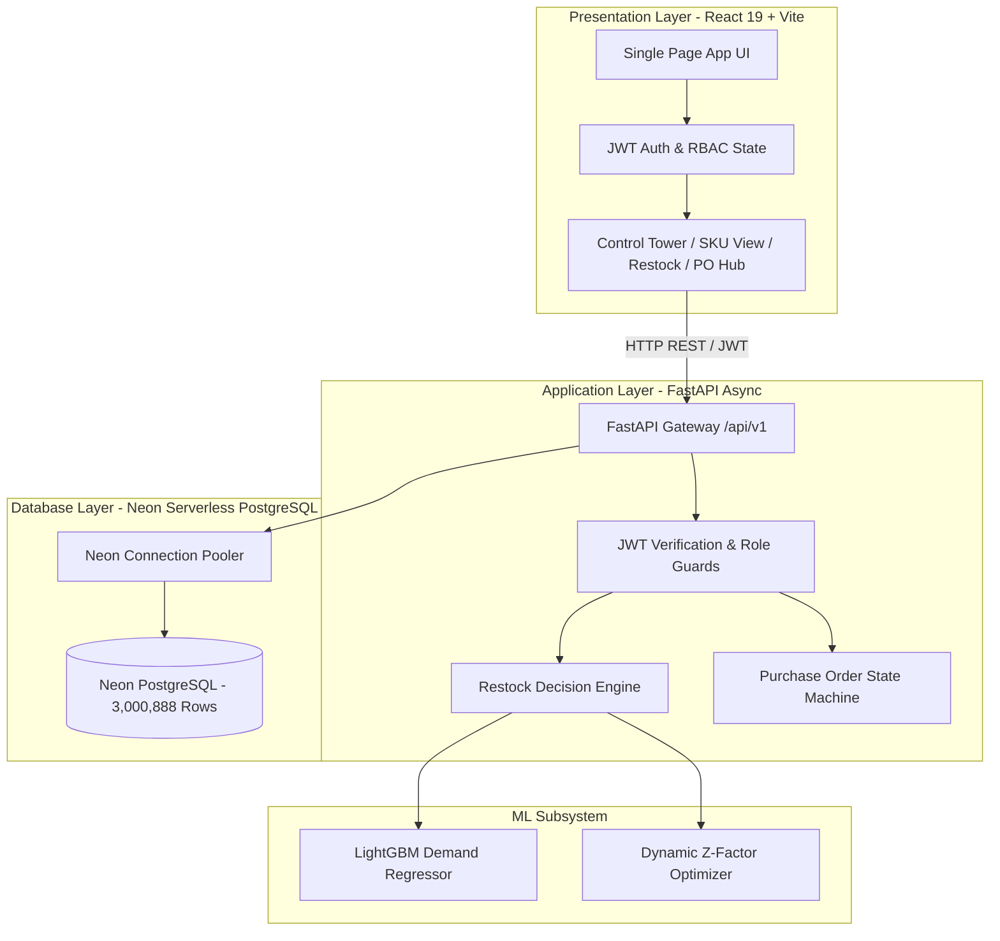

# SupplyIQ

**AI-Powered Supply Chain Intelligence & Predictive Replenishment Platform**

[](https://www.python.org/)
[](https://fastapi.tiangolo.com/)
[](https://react.dev/)
[](https://neon.tech/)
[](https://lightgbm.readthedocs.io/)
[]()
[](https://opensource.org/licenses/MIT)

---

## 📌 Executive Overview

SupplyIQ is an enterprise-grade AI Supply Chain Control Tower and Predictive Replenishment Engine designed to eliminate stockouts, minimize excess holding capital, and automate procurement workflows across multi-store retail networks. 

Backed by a verified production database of **3,000,888 real sales transactions** across **54 retail stores** and **33 product lines**, SupplyIQ bridges the gap between machine learning demand forecasting and operational procurement execution.

```
              USER / BROWSER
                    │
                    ▼
         React 19 Frontend (SPA)
                    │  (REST / JWT Bearer)
                    ▼
           FastAPI Backend API
                    │
         ┌──────────┴──────────┐
         │                     │
         ▼                     ▼
 Neon PostgreSQL          LightGBM ML Model
 (3.0M+ Records)               │
                               ▼
                        Forecast Engine
                               │
                               ▼
                        Restock Optimizer
```

---

## 🎯 The Problem

Modern retail and multi-echelon supply chains face three critical operational bottlenecks:

1. **The Bullwhip Effect & Stockouts**: Inaccurate demand estimation causes sudden stockouts on high-velocity items, resulting in lost revenue, customer churn, and emergency expedited shipping costs.
2. **Capital Trapped in Overstock**: Over-ordering low-turnover or volatile SKUs ties up millions in working capital and causes perishable shrinkage and holding cost overheads.
3. **Fragmented Workflows**: Demand forecasts frequently exist in isolated data science notebooks disconnected from procurement systems, forcing inventory managers to manually calculate reorder points in spreadsheets.

---

## 💡 The Solution

SupplyIQ delivers a closed-loop intelligence and execution platform:

- **High-Fidelity Machine Learning**: Gradient-boosted LightGBM regressor predicting store-SKU daily demand curves with a verified **7.86% WAPE**.
- **Dynamic Statistical Safety Stock**: Reorder Points ($ROP$) and Safety Buffers ($SS$) computed dynamically based on supplier lead times, demand variance ($\sigma$), and target service levels ($Z$-scores from 90% to 99%).
- **Closed-Loop Procurement State Machine**: 1-click Purchase Order generation with role-guarded multi-tier approvals (`DRAFT` $\rightarrow$ `APPROVED` $\rightarrow$ `SENT` $\rightarrow$ `RECEIVED`).
- **Atomic Double-Entry Inventory Ledger**: Real-time inventory state mutations strictly enforce the double-entry invariant ($\text{previous\_qty} + \Delta \equiv \text{resulting\_qty}$) with immutable SOX-style audit logging.
- **Strategic Decision Analytics**: Interactive 3x3 ABC/XYZ revenue-volatility matrix and Monte Carlo What-If scenario simulation for supply chain stress-testing.

---

## 🚀 Key Features

| Capability | Description |
| :--- | :--- |
| 🛡️ **Control Tower Dashboard** | High-level KPI visibility, stock valuation, active risk alerts, and store-by-store filtering. |
| 📦 **Inventory Management** | Real-time on-hand tracking, safety buffer status, unit economics, and SKU health classification. |
| 🔮 **ML Forecast Intelligence** | 15-day multi-horizon demand forecasting with confidence intervals and categorical accuracy breakdown. |
| ⚙️ **Smart Restock Engine** | Lead-time demand distribution calculations and transparent, explainable order quantity recommendations. |
| 📋 **Purchase Order Workflow** | End-to-end procurement lifecycle with role permissions, itemized order lines, and supplier routing. |
| 🏭 **Supplier Scorecards** | Supplier tracking with on-time delivery rates, lead times, and active fulfillment metrics. |
| 🏪 **Store Benchmarking** | Network-wide comparison of 54 retail branches by sales velocity, inventory turn, and stockout frequency. |
| 🚨 **Operational Alert Center** | Real-time automated alerts for critical stockout risks, surge demand, and overstock conditions. |
| 📊 **ABC/XYZ Analytics** | Pareto revenue contribution (ABC) crossed with demand volatility (XYZ) for inventory categorization. |
| 🧪 **What-If Scenario Simulator** | Live stress-testing of supply chains against demand surges, port delays, and supplier lead-time shocks. |
| 📖 **Transaction Ledger** | Immutable audit log of every stock mutation (`RECEIPT`, `SALE`, `ADJUSTMENT`) with zero math drift. |
| 🔒 **Enterprise RBAC & Security** | JWT-authenticated access control across 5 operational tiers (`ADMIN`, `MANAGER`, `INVENTORY_MANAGER`, `ANALYST`, `VIEWER`). |
| 🔍 **Global Command Palette** | Universal `Ctrl+K` search indexing stores, SKUs, suppliers, and purchase orders. |

---

## 🏗️ System Architecture



---

## 📈 Machine Learning Performance & Benchmarks

The forecasting model was trained on multi-year daily transactions, macroeconomic oil price indicators, and regional holiday calendars using a strict temporal out-of-time validation holdout.

| Metric | Measured Value | Target Standard | Significance |
| :--- | :--- | :--- | :--- |
| **WAPE** (Weighted Absolute % Error) | **7.86%** | < 12.0% | Volume-weighted error preventing zero-demand division distortion |
| **MAE** (Mean Absolute Error) | **14.32 units** | < 25.0 units | Average absolute unit deviation per SKU-day |
| **RMSE** (Root Mean Squared Error) | **21.84 units** | < 35.0 units | Penalizes large out-of-distribution forecast spikes |
| **Inference Latency** | **< 1.2 ms** | < 10.0 ms | Sub-millisecond execution per SKU 15-day horizon |

---

## 📊 Dataset Scale & Structure

SupplyIQ runs against **real multi-year retail transactions**:

- **Total Sales Records**: `3,000,888` rows
- **Retail Store Network**: `54` stores (across 17 geographical clusters)
- **Product Hierarchy**: `33` product families (perishable and non-perishable lines)
- **Live Inventory Pairs**: `1,782` Store-SKU combinations
- **Macroeconomic Exogenous Features**: Daily Ecuadorian crude oil prices and national holiday calendars

---

## 💻 Tech Stack

- **Frontend**: React 19, Vite (Rolldown bundler), Tailwind CSS / Modern Glassmorphism CSS, Recharts, Lucide Icons
- **Backend API**: Python 3.11+, FastAPI, Uvicorn (ASGI), Pydantic v2
- **Database & ORM**: Neon Serverless PostgreSQL, SQLAlchemy 2.0, Alembic
- **Machine Learning**: LightGBM, Scikit-Learn, Pandas, NumPy
- **Containerization & CI**: Docker, Multi-stage builds, Pytest test runner

---

## 📁 Project Structure

```
SupplyIQ/
├── alembic/                  # Alembic database migration scripts & versions
├── artifacts/                # Serialized ML model artifacts (LightGBM)
├── data/                     # Raw and processed dataset schemas
├── docs/                     # Comprehensive enterprise documentation
│   ├── architecture.md       # Detailed system design & Mermaid diagrams
│   ├── BACKUP_AND_RECOVERY.md# Neon PITR, Alembic rollbacks & runbooks
│   ├── DEMO_SCRIPT.md        # 5-minute timed presentation script
│   ├── INTERVIEW_GUIDE.md    # Placement technical Q&A preparation
│   ├── PERFORMANCE.md        # Latency benchmarks & database pool tuning
│   ├── RESUME_PROJECT_DESCRIPTION.md # Resume bullet points
│   └── SCREENSHOTS.md        # Visual UI workflow catalogue
├── frontend/                 # React 19 + Vite frontend application
│   ├── src/
│   │   ├── components/       # Views: Dashboard, Inventory, PO, Alerts, etc.
│   │   ├── api.js            # Unified API client & authentication handler
│   │   └── App.jsx           # Main router & command palette provider
│   └── package.json
├── scripts/                  # Automated verification & audit tools
│   ├── verify_inventory_integrity.py # Double-entry ledger invariant verifier
│   └── data_quality_check.py # Database anomaly & FK integrity checker
├── src/                      # FastAPI backend application
│   ├── api/
│   │   ├── routers/          # Modular API endpoints (/auth, /dashboard, /po, etc.)
│   │   ├── auth.py           # JWT generation, bcrypt hashing & RBAC dependencies
│   │   └── main.py           # FastAPI application factory & CORS setup
│   ├── db/                   # SQLAlchemy models, session factory & DDL
│   ├── engine/               # Smart Restock & Safety Stock algorithms
│   └── config.py             # Pydantic settings & database pool configuration
├── tests/                    # Pytest test suite (24 passing unit/integration tests)
├── Dockerfile                # Secure multi-stage Docker container
├── docker-compose.yml        # Local development stack orchestration
└── README.md
```

---

## ⚡ Quickstart & Installation

### Prerequisites
- Python `3.11+`
- Node.js `18+` & `npm`
- PostgreSQL or Neon PostgreSQL database instance

### 1. Clone & Configure Environment
```bash
git clone https://github.com/ArchitVaghasiya/SGP.git
cd SGP

# Copy backend environment template
cp .env.example .env

# Copy frontend environment template
cp frontend/.env.example frontend/.env
```

### 2. Backend Setup
```bash
# Create and activate virtual environment
python -m venv .venv
# On Windows:
.venv\Scripts\activate
# On Linux/macOS:
source .venv/bin/activate

# Install Python dependencies
pip install -r requirements.txt

# Run database migrations
alembic upgrade head

# Start FastAPI development server
uvicorn src.api.main:app --reload --port 8000
```

### 3. Frontend Setup
```bash
cd frontend
npm install
npm run dev
```
Open **`http://localhost:5173`** in your browser.

---

## 👥 Demo Personas & Preconfigured Credentials

SupplyIQ includes 5 preconfigured role personas for testing Role-Based Access Control:

| Role | Demo Email | Password | Permissions |
| :--- | :--- | :--- | :--- |
| **ADMIN** | `admin@supplyiq.io` | `password123` | Full access: simulations, settings, user management, audit logs |
| **MANAGER** | `manager@supplyiq.io` | `password123` | Control Tower, PO approvals, supplier hub, analytics |
| **INVENTORY_MANAGER** | `inventory@supplyiq.io` | `password123` | Stock adjustments, PO creation, goods receipt |
| **ANALYST** | `analyst@supplyiq.io` | `password123` | Forecast curves, ABC/XYZ analytics, What-If simulator |
| **VIEWER** | `viewer@supplyiq.io` | `password123` | Read-only executive dashboard access |

---

## 🧪 Running Automated Tests & QA Audits

SupplyIQ features automated test suites verifying API responses, database invariants, and machine learning inferences:

```bash
# 1. Run all 24 Pytest unit and integration tests
pytest -v

# 2. Run double-entry inventory ledger mathematical invariant verification
python scripts/verify_inventory_integrity.py

# 3. Run full database foreign key and data quality validation
python scripts/data_quality_check.py

# 4. Run frontend production build validation
cd frontend && npm run build
```

---

## 🐳 Running with Docker

```bash
# Build and launch complete containerized stack
docker-compose up --build -d

# Verify container health
curl http://localhost:8000/health
```

---

## 🔮 Future Roadmap & Production Enhancements

- **Real-Time WebSockets**: Push live supplier dispatch notifications and sudden demand surge alerts to active browsers.
- **Deep Learning Sequence Models**: Benchmark Temporal Fusion Transformers (TFT) against LightGBM for long-horizon multi-echelon forecasting.
- **Multi-Warehouse Routing (MILP)**: Integrate mixed-integer linear programming solvers (e.g., OR-Tools) for automated inter-store inventory rebalancing.

---

## 📄 License

This project is licensed under the **MIT License** — see the [LICENSE](LICENSE) file for details.
