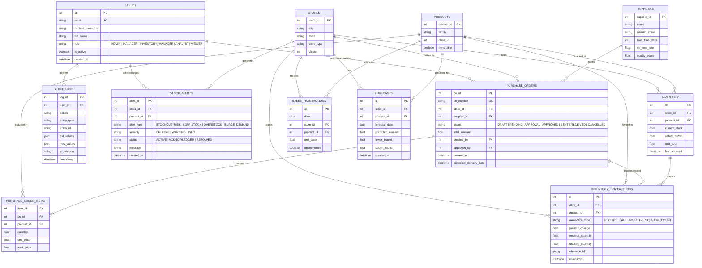
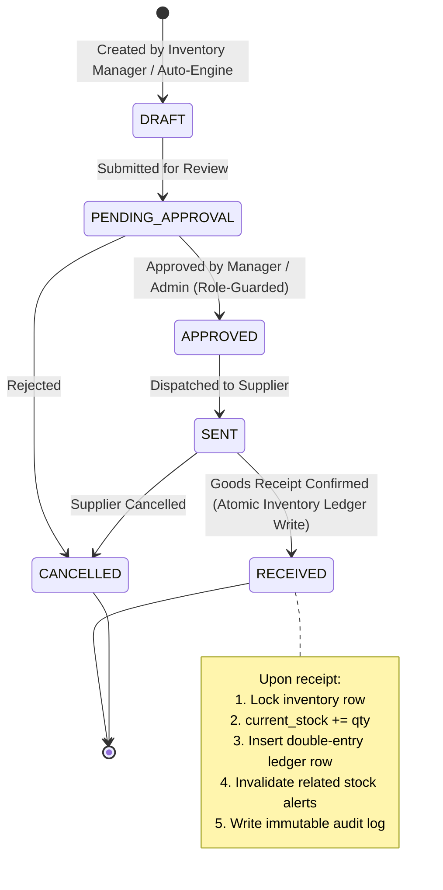

# SupplyIQ Architecture & System Design

SupplyIQ is an enterprise AI Supply Chain Intelligence & Predictive Replenishment Control Tower designed for high-throughput retail demand forecasting, dynamic safety stock optimization, and automated multi-echelon procurement workflows.

---

## 1. End-to-End System Architecture

The system utilizes a modern decoupled full-stack architecture with React 19 on the presentation layer, FastAPI on the high-concurrency asynchronous API layer, and Neon Serverless PostgreSQL with connection pooling as the primary persistent data store.

```mermaid
flowchart TB
    subgraph ClientLayer [Presentation Layer - React 19 + Vite]
        UI[SupplyIQ Dashboard SPA]
        Router[View Router & State Manager]
        AuthCtx[JWT Auth & RBAC Context]
        Charts[Recharts & Lucide UI]
    end

    subgraph APILayer [API Gateway & Backend - FastAPI]
        FastAPI[FastAPI Asynchronous Gateway]
        CORS[CORS Middleware & Security Headers]
        AuthMW[JWT Bearer & Role Guards]
        
        subgraph Subservices [Domain Core Services]
            DashService[Dashboard Analytics Engine]
            RestockEngine[Restock Decision Engine]
            POService[Atomic PO State Machine]
            AlertService[Rule-Based Alert Processor]
            SimService[What-If Scenario Simulator]
        end
    end

    subgraph MLLayer [Machine Learning Forecasting Subsystem]
        LGBM[LightGBM Regressor Model]
        FeatEng[Feature Engineering Pipeline]
        SafetyCalc[Statistical Safety Stock Optimizer]
    end

    subgraph DataLayer [Persistent Data Storage - Neon PostgreSQL]
        NeonPool[Neon Connection Pooler]
        NeonDB[(Neon PostgreSQL Serverless)]
        
        subgraph Schemas [Core Tables (3,000,888+ Records)]
            SalesTab[(sales_transactions)]
            InvTab[(inventory)]
            LedgerTab[(inventory_transactions)]
            POTab[(purchase_orders)]
            AlertTab[(stock_alerts)]
            AuditTab[(audit_logs)]
            ForecastTab[(forecasts)]
        end
    end

    UI --> Router
    Router --> AuthCtx
    AuthCtx --> Charts
    Charts -->|HTTP/REST with JWT| FastAPI

    FastAPI --> CORS
    CORS --> AuthMW
    AuthMW --> Subservices

    RestockEngine --> LGBM
    RestockEngine --> SafetyCalc
    LGBM --> FeatEng

    Subservices --> NeonPool
    NeonPool --> NeonDB
    NeonDB --- Schemas
```

---

## 2. Machine Learning Demand Forecasting Pipeline

The forecasting pipeline processes multi-year transaction data (over 3,000,000 sales records), aggregates at the Store-SKU-Day level, extracts temporal, lag, and exogenous macroeconomic signals, and produces multi-horizon demand forecasts evaluated on WAPE, MAE, and RMSE.

```mermaid
flowchart LR
    subgraph Ingestion [1. Historical Sales Ingestion]
        RawSales[3,000,888 Sales Records]
        OilData[Ecuadorian Oil Prices]
        HolidayData[National & Regional Holidays]
    end

    subgraph Preprocessing [2. Feature Engineering]
        Agg[Daily Store-SKU Aggregation]
        Lags[Lagged Sales (t-7, t-14, t-30)]
        Rolling[Rolling Means & Volatility (7d, 28d)]
        Calendar[DayOfWeek, Month, IsHoliday, Promo Flag]
    end

    subgraph Modeling [3. LightGBM Training & Inference]
        Train[Temporal Split Validation]
        LGBMModel[LightGBM Gradient Boosting Regressor]
        Inference[Multi-Step Point & Horizon Forecasts]
    end

    subgraph Evaluation [4. Model Performance Verification]
        WAPE[WAPE: 7.86%]
        MAE[MAE: 14.32]
        RMSE[RMSE: 21.84]
    end

    RawSales --> Agg
    OilData --> Preprocessing
    HolidayData --> Preprocessing
    Agg --> Lags
    Agg --> Rolling
    Agg --> Calendar

    Lags --> Train
    Rolling --> Train
    Calendar --> Train
    Train --> LGBMModel
    LGBMModel --> Inference

    Inference --> Evaluation
```

---

## 3. Database Entity-Relationship Model (ERD)

The relational schema ensures ACID compliance, referential integrity via strict foreign keys, and complete traceability across inventory movements and governance logs.



---

## 4. Predictive Restock Decision Engine

SupplyIQ calculates the dynamic Reorder Point ($ROP$) and Recommended Order Quantity ($ROQ$) based on lead-time demand distribution and configurable service levels ($Z$-factor).

$$SS = Z \times \sigma_{\text{lead}} \times \sqrt{L}$$
$$ROP = (\bar{d} \times L) + SS$$
$$\text{Net Inventory} = \text{Current Stock} + \text{In-Transit Stock}$$
$$ROQ = \max(0, ROP - \text{Net Inventory})$$

```mermaid
flowchart TD
    Start([SKU Evaluation Triggered]) --> FetchData[Fetch Store-SKU Current Stock, Lead Time & In-Transit POs]
    FetchData --> FetchForecast[Extract LightGBM Predicted Demand for Lead Horizon L]
    FetchForecast --> CalcVariance[Compute Demand StdDev sigma and Z-factor for Target Service Level]
    CalcVariance --> CalcSS[Calculate Safety Stock SS = Z * sigma * sqrt(L)]
    CalcSS --> CalcROP[Calculate Reorder Point ROP = LeadDemand + SS]
    CalcROP --> CalcNet[Compute Net Inventory = Current Stock + In-Transit]
    CalcNet --> CheckThreshold{Net Inventory < ROP ?}

    CheckThreshold -- Yes --> RecommendPO[Generate Recommended Order Qty = ROP - Net Inventory]
    RecommendPO --> DetermineUrgency{Net Inventory <= SS ?}
    DetermineUrgency -- Yes --> CriticalUrgency[Set Urgency = CRITICAL & Trigger Stockout Alert]
    DetermineUrgency -- No --> NormalUrgency[Set Urgency = RECOMMENDED]
    
    CheckThreshold -- No --> SafeStatus[Status = HEALTHY, Recommended Qty = 0]

    CriticalUrgency --> Output([Restock Proposal Formed])
    NormalUrgency --> Output
    SafeStatus --> Output
```

---

## 5. Purchase Order Lifecycle & State Machine

Purchase orders follow strict enterprise state transitions with role guards, audit logging, and atomic database execution upon receiving.


